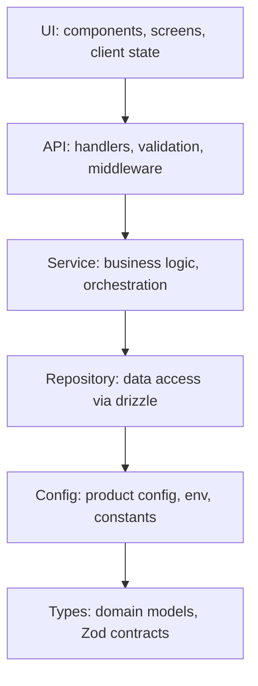
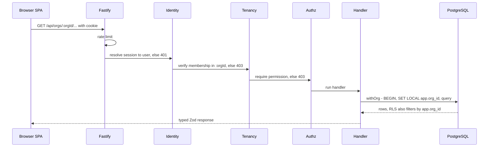
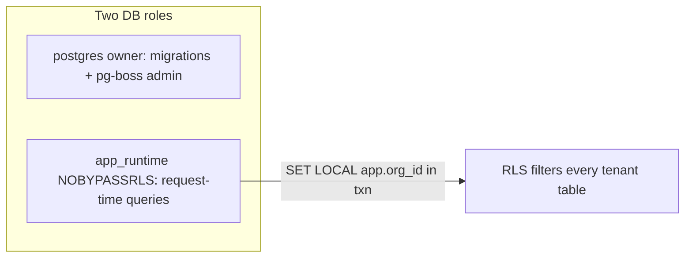
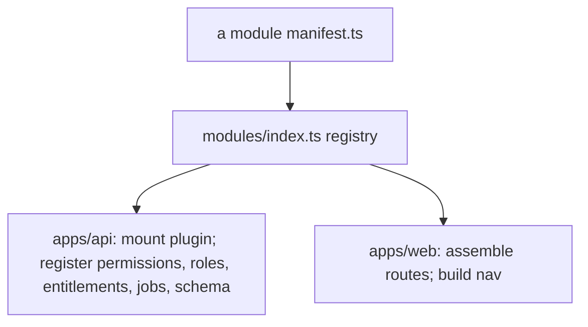

# Architecture & Developer Guide

A guided tour of the codebase for someone joining the project. It teaches **how
the system fits together and how to work in it**. For *why* a decision was made,
[`SPEC.md`](../SPEC.md) is the canonical, locked source of truth — this guide
links to it rather than restating it, so there is only ever one source of truth.

---

## 1. Start here — reading path

Follow these in order; each builds on the last.

1. **[`README.md`](../README.md)** — what this is, and get it running locally.
2. **This document** — the mental model and how the pieces connect.
3. **[`SPEC.md`](../SPEC.md)** — the locked decisions and *why* (skim the D1–D16 table + §9 tenancy).
4. **[`.claude/architecture.md`](../.claude/architecture.md)** — the layering & import rules you must follow.
5. **[`docs/FORKING.md`](FORKING.md)** — how a fork turns this into a product.
6. **[`docs/DECISION-framework-control-plane.md`](DECISION-framework-control-plane.md)** — the customization knobs in depth.

---

## 2. The mental model in one paragraph

Every product built from this scaffold is a **modular monolith**: one React/Vite
SPA, one TypeScript/Fastify API, one PostgreSQL database, shipped as a **single
container image** (Fastify serves both the API and the built SPA) plus a
database. Everything under `apps/` and `packages/` is **platform you inherit**;
product work happens in **`product.config.ts` and `modules/`**. There are exactly
**two abstraction ports** — `@platform/identity` and `@platform/email` —
everything else is called directly. Tenant isolation is **app-layer scoping
(`withOrg`) with PostgreSQL Row-Level Security as a backstop**.

---

## 3. Monorepo map

```
platform-scaffold/
├── product.config.ts          # THE product definition — branding, terminology, capabilities, orgTypes
├── apps/
│   ├── api/                    # Fastify composition root; serves the built SPA in prod
│   └── web/                    # Vite SPA: shell, router assembly, providers
├── packages/                   # PLATFORM CODE — forks rarely touch this
│   ├── platform-contracts/     # shared Zod schemas, error envelope, pagination
│   ├── platform-config/        # product.config schema (Zod) + loader
│   ├── platform-db/            # drizzle client, migration runner, core schema
│   ├── platform-identity/      # PORT: session/user + better-auth adapter
│   ├── platform-authz/         # permissions, roles, require() middleware, <Can> gate
│   ├── platform-tenancy/       # org context, withOrg scoped-db factory, RLS helpers
│   ├── platform-entitlements/  # entitlement schema + check API + defaults
│   ├── platform-audit/         # audit schema + writer + viewer contracts
│   ├── platform-email/         # PORT: send({to,template,data}) + SMTP/dev adapters
│   ├── platform-jobs/          # pg-boss wrapper: defineJob/enqueue/schedule
│   └── platform-ui/            # component library, theme provider, terminology hook
├── modules/                    # PRODUCT CODE — this is what forks replace
│   ├── index.ts                # module registry (one line per module)
│   └── reference-workspace/    # the worked-example module (Writer/Reader "Spaces & Notes")
│       ├── manifest.ts         # declares permissions, roles, entitlements, nav, jobs, schema
│       ├── shared/             # Zod contracts for this module
│       ├── api/                # Fastify plugin, services, repositories, module schema
│       └── web/                # routes, screens, nav contributions
├── ops/                        # operator CLI
├── Dockerfile                  # multi-stage: build web+api → single runtime image
└── docker-compose.yml          # postgres + mailpit (+ the `app` image behind --profile app)
```

**The fork contract:** product work lives in `product.config.ts` and `modules/`;
`apps/` and `packages/` are inherited. This boundary is what makes fork-and-diverge
livable. See [`SPEC.md` §6.1](../SPEC.md).

---

## 4. Layered architecture

Dependencies flow **downward only** — a layer may import from layers below it,
never above.



How the abstract layers map onto the real monorepo:

| Layer | Where it lives here |
|-------|---------------------|
| **Types** | `packages/platform-contracts`, each module's `shared/` (Zod contracts), `*.types.ts` |
| **Config** | `product.config.ts`, `packages/platform-config`, `apps/api` env schema |
| **Repository** | `*.repository.ts`, `packages/platform-db`, the `withOrg` scoped-db from `packages/platform-tenancy` |
| **Service** | `*.service.ts` (pure business logic; e.g. `modules/reference-workspace/api/*.service.ts`) |
| **API** | `apps/api`, each module's `api/` Fastify plugin, `packages/platform-authz` middleware |
| **UI** | `apps/web`, each module's `web/`, `packages/platform-ui` |

The rules (and what actually enforces them) are in
[`.claude/architecture.md`](../.claude/architecture.md).

---

## 5. Request lifecycle

The single most useful thing to internalize — how auth, tenancy, and the layers
work together on one request to an org-scoped endpoint:



Canonical version: [`SPEC.md` §6.4](../SPEC.md).

### Authentication model — cookies, not browser-held JWTs

The session is a **server-side session with an `httpOnly` cookie**, not a JWT
held by the browser. On sign-in, `better-auth` (behind `@platform/identity`)
creates a row in the `session` table and sets a signed, `httpOnly`, `SameSite`
cookie; the browser attaches it automatically on every request — the SPA only
sets `credentials: 'include'`. This is what powers server-side revocation: the
**Security → Active sessions** screen lists and deletes those rows.

**"Isn't JWT the industry standard?"** JWT is a token *format* (RFC 7519), not a
login strategy. It is the standard *inside* OAuth2/OIDC and for stateless
service-to-service / third-party API calls. For a **first-party web app's own
session**, the norm — and OWASP guidance — is exactly this `httpOnly` cookie:
major first-party apps (GitHub, Stripe's dashboard, Google) run their web
sessions on cookies, not a JWT in `localStorage`, because a token in
`localStorage` is readable by any injected script (XSS) and can't be revoked.
Cookies trade in a CSRF risk, which better-auth mitigates (SameSite + CSRF
checks).

**Enterprise SSO later — no conflict.** SSO (OIDC/SAML) governs *how a user
authenticates*; the session cookie governs *how the app remembers them
afterward*. They are orthogonal and compose cleanly: the user completes the SSO
handshake with the IdP (Okta, Entra ID, Google Workspace…), the app verifies the
IdP's assertion (in OIDC, itself a JWT — used once at login), then mints its own
session cookie. Even JWT-based SPAs usually end up here. The
**`@platform/identity` port is the seam built for this**: today it is
better-auth; a future enterprise-SSO implementation (SPEC names WorkOS) swaps in
behind the same interface with nothing outside the package changing.

**Bottom line:** the cookie-session model incurs no rework debt for SSO. Keeping
a first-party session *behind the identity port* actually makes multi-IdP SSO
cleaner than a browser-held-JWT approach would. Reach for JWTs when the need is
genuinely stateless and cross-boundary (service-to-service, a public API you
hand to customers, native clients) — not for this SPA's own login.

---

## 6. Multi-tenancy & the security model

This is the part to get right. Isolation has **two independent layers**:

1. **App layer (primary).** Handlers never touch tenant tables directly. They get
   a scoped client from `withOrg(orgId, tx => …)` (in `@platform/tenancy`), which
   opens a transaction and runs `SET LOCAL app.org_id = $1`. Membership in
   `:orgId` is verified **before** any handler runs. There is no code path that
   queries tenant tables outside `withOrg` — a guard test enforces this.
2. **RLS (backstop).** Every tenant table carries `org_id` plus a policy
   `USING (org_id = current_setting('app.org_id', true)::uuid)` with
   `FORCE ROW LEVEL SECURITY`. The runtime connects as a **non-owner role that
   cannot bypass RLS**; migrations run as a separate privileged role. So even if
   app scoping were bypassed, the database still refuses cross-tenant rows.



The canonical list of tenant tables is `TENANT_TABLES` in
`packages/platform-tenancy/src/rls.ts`. One intentional exception exists — the
**shared plane** (cross-org published content) is marked `@shared-plane` and has
no RLS by design. Full detail: [`SPEC.md` §9](../SPEC.md).

---

## 7. The control plane — how products are customized

Two surfaces, nothing else:

- **`product.config.ts`** — `profile`/`capabilities` (B2C vs B2B), `branding`
  (theme tokens, logo, radius, fonts), `terminology` (rename nouns, e.g.
  Organization → Clinic), `navigation`, `orgTypes` (e.g. writer/reader,
  buyer/seller), and email identity. Validated by Zod at boot.
- **A module manifest** (`modules/<name>/manifest.ts`) — declares the feature's
  `permissions`, `roles`, `entitlements`, `nav`, `jobs`, drizzle `schema`, and
  its `registerApi` / `webRoutes`.

Depth and archetype mapping (B2C / B2B / marketplace / finance):
[`docs/DECISION-framework-control-plane.md`](DECISION-framework-control-plane.md).

---

## 8. The module system

A module is a workspace package exporting a **manifest**. `modules/index.ts` is
the single registry. The API composition root and the web shell each iterate it:



Modules receive platform services through a `PlatformContext` (scoped-db factory,
authz checker, audit writer, email sender, job enqueuer, entitlement checker,
config). **Modules never import better-auth or a raw drizzle client** — they go
through the ports and context. **Adding a module = one directory + one registry
line; removing = the reverse** (the reference module is deletable this way).

---

## 9. Tech stack — what, why, and how it's wired here

For the locked rationale behind each choice see the decision table in
[`SPEC.md`](../SPEC.md) (D1–D16); this is the "how it shows up in the code" view.

| Area | Choice | How it's wired here |
|------|--------|---------------------|
| Runtime | Node 22 LTS, TypeScript (strict, zero `any`) | `apps/api`, all `packages/*` |
| API | **Fastify 5** + `fastify-type-provider-zod`, helmet, rate-limit, `@fastify/static` | `apps/api` is the composition root; serves `/api/*` and the built SPA |
| Auth | **better-auth**, behind the `@platform/identity` **port** | mounted under `/api/auth/*`; nothing else imports better-auth |
| ORM | **Drizzle** + drizzle-kit | `packages/platform-db`; SQL-transparent, which the RLS work needs |
| DB | **PostgreSQL 16** with RLS | two roles (owner for migrations, `app_runtime` NOBYPASSRLS at runtime) |
| Jobs | **pg-boss** via `@platform/jobs` | workers run **in the API process** (v1); `defineJob/enqueue/schedule` |
| Email | SMTP / dev (Mailpit), behind the `@platform/email` **port** | `send({to,template,data})` |
| Validation | **Zod** contracts at every boundary | module `shared/`, `platform-contracts` |
| Frontend | **React + Vite**, **TanStack Router**, **TanStack Query** | `apps/web`; routes assembled from the module registry |
| UI/styling | **Radix** primitives in `@platform/ui`, **Tailwind v4** design tokens | tokens via `@theme` + runtime `ThemeProvider`; no literal colors in components (enforced by a test) |
| Logging | pino | structured JSON in prod, pretty in dev |
| Monorepo | pnpm workspaces + **Turborepo** | run pnpm via `corepack pnpm` |
| Deploy | multi-stage **Docker** → single image | Fastify serves API + SPA; `docker compose --profile app` |

---

## 10. Make your first change

```bash
corepack pnpm install                       # pnpm is invoked via corepack

# Backing services only (Postgres + Mailpit), then run the app from source:
docker compose up -d
#   … or bring up the full production image:
docker compose --profile app up -d --build  # app at http://localhost:3000

# Per-package checks (run from the package dir):
cd apps/api && pnpm vitest run && pnpm lint && pnpm exec tsc --noEmit
cd apps/web && pnpm vitest run && pnpm lint && pnpm exec tsc --noEmit

# Cross-package test run (from the repo root):
corepack pnpm exec vitest run

# Migrations:
pnpm exec drizzle-kit generate && pnpm exec drizzle-kit migrate
```

**Conventions that matter** (full list in
[`.claude/skills/code-gen/SKILL.md`](../.claude/skills/code-gen/SKILL.md)):

- **TDD**: write the test first, then implement.
- Functions < 50 lines, files < 300 lines, static typing everywhere (no `any`).
- **Zod contracts at API boundaries**; one ORM, one router, one styling system.
- **Never query a tenant table outside `withOrg`** — a guard test fails the build if you do.
- **No literal colors in `@platform/ui` components** — use design tokens (`var(--color-*)`); a test enforces it.
- Conventional commits (`feat:`, `fix:`, `refactor:`, `test:`, `docs:`); branch `<type>/<description>`.

---

## 11. Where to go deeper

| Topic | Document |
|-------|----------|
| Locked decisions & the *why* | [`SPEC.md`](../SPEC.md) |
| Layering & import rules | [`.claude/architecture.md`](../.claude/architecture.md) |
| Turning the scaffold into a product | [`docs/FORKING.md`](FORKING.md) |
| The customization knobs | [`docs/DECISION-framework-control-plane.md`](DECISION-framework-control-plane.md) |
| Deployment & the two-role RLS model | [`docs/DEPLOYMENT.md`](DEPLOYMENT.md) · [`docs/AWS-DEPLOYMENT.md`](AWS-DEPLOYMENT.md) |
| How the reference module was built | [`docs/PLAN-spaces-notes-reference.md`](PLAN-spaces-notes-reference.md) |
